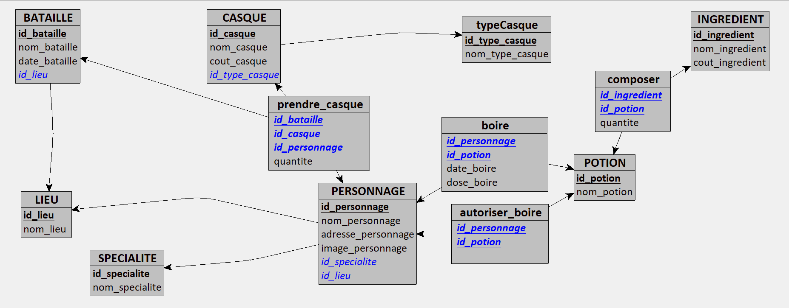

# Projet de base de données

## Fichiers : 
**- Template :** fichier de temporisation de sortie, navbar pour les deux autres fichiers  
**- Bdd-connect :** récupère les fichiers en bdd  
**-Liste_... :** Liste de tous les personnages et toutes les potions   
**-Potion/personnage :** affiche en détail une potion ou un personnage
**-dossiers requêtes :** différentes requêtes utilisées sur heidiSQL

### MLD

### Utilisation :  
heidiSQL, SQL, PHP, PDO, Laragon, HTML, CSS, bootstrap
